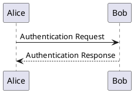

# Quarto PlantUML Diagram Extension

A Quarto extension for embedding PlantUML Diagrams in your Quarto documents.

[](https://quarto.org/docs/extensions/)
[](https://github.com/chuck650/quarto-extension-plantuml/actions/workflows/test.yml)
[](https://github.com/chuck650/quarto-extension-plantuml/blob/main/LICENSE)

---

##  Prerequisites

This extension requires a local installation of the PlantUML command-line utility. The `plantuml` executable must be available in your system's `PATH`.

Please follow the official [PlantUML installation guide](https://plantuml.com/starting) to set it up for your operating system. The `plantuml` executable is usually installed via a package manager like `dnf` on Fedora.

---

## 💻 Installation

Install the extension by running the following command in your project's terminal:

```bash
quarto install extension chuck650/quarto-extension-plantuml
```

---

## 🛠️ Usage

To embed a plantUML diagram in your Quarto document, create a `plantuml` code block.

### Example

**Input (`.qmd`):**

Embed a plantuml diagram in your Quarto document by creating a `plantuml` code block like this:

~~~qmd

~~~

---

## ⚙️ Configuration

While the extension can be used without project-level configuration, you can add it to your `_quarto.yml` file to ensure it's consistently applied across your project.

Add the following to your project's `_quarto.yml`:

```yaml
project:
  type: default
  filters:
    - plantuml
```

---

## ⚖️ License and Contribution

This extension is released under the **MIT License**.

We welcome contributions from the community! If you have suggestions, find a bug, or want to add a feature, please feel free to:

1. **Open an Issue** to discuss the change.
2. **Submit a Pull Request** with your proposed changes.
